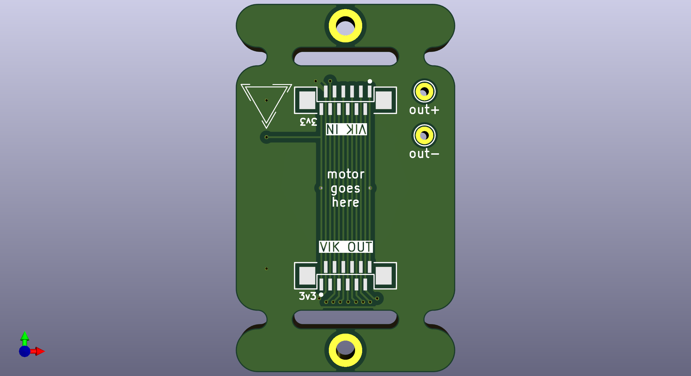
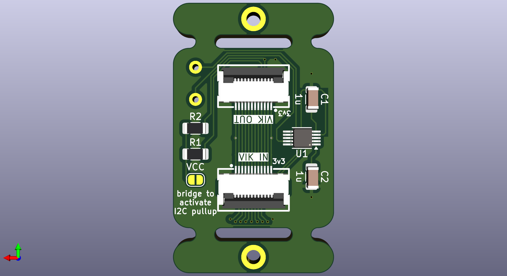
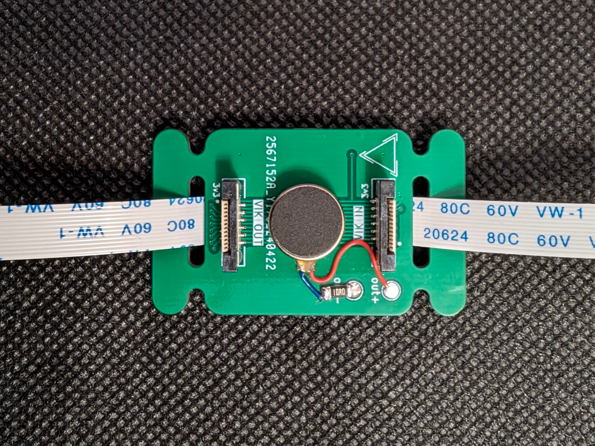
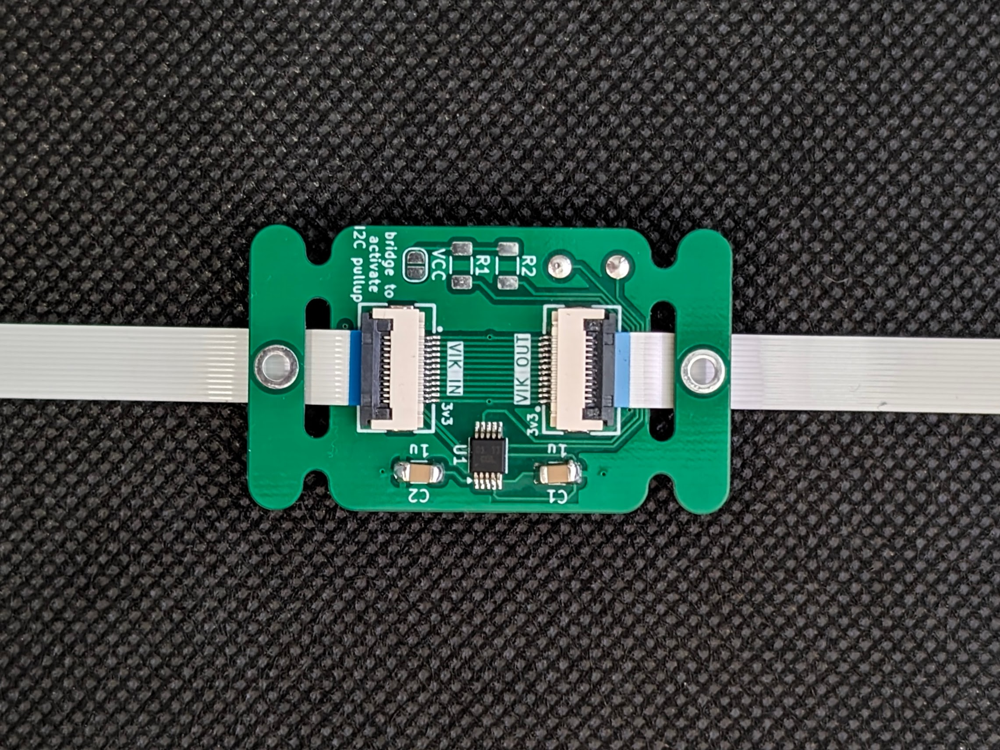

# Haptic feedback DRV2605L module

## Overview

This is a VIK module made to house the DRV2605L motor controller for haptic feedback.

DRV2605L controller uses only I2C communication, so the module may serve as a VIK pass-through allowing a next module to be connected.

Module adheres to default small PCB size and mounting with additional holes for FFC cable which can also be used for breaking off mounting holes if even smaller size is needed.

## Fabrication

For PCB fabrication, you can use the files in the production folder.

- [haptic-drv2605l.zip](./production/haptic-drv2605l.zip) - the file used to fabricate the pcb

## BOM

- DRV2605L motor controller
- 2 1uF capacitors (SMD 1206 size)
- 2 4.7kOhm resistors (SMD 1206 size)
- vertical and horizontal VIK connectors
- LRA or ERM [motor](https://docs.qmk.fm/#/feature_haptic_feedback?id=known-supported-hardware)

## VIK module certification

| Category                | Classification       | Response             |
| ----------------------- | -------------------- | -------------------- |
| FPC connector           | Required             | :heavy_check_mark:   |
| Breakout pins           | Recommended          | :x:                  |
| Uses: SPI               | Optional             | :x:                  |
| SPI used for SPI only   | Strongly recommended | N/A                  |
| Uses: I2C               | Optional             | :heavy_check_mark:   |
| I2C used for I2C only   | Strongly Recommended | :heavy_check_mark:   |
| I2C pull ups            | Required             | 4.7kΩ [1] |
| Uses: RGB               | Optional             | :x:                  |
| Uses: Extra GPIO 1      | Optional             | :x:                  |
| Uses: Extra GPIO 2      | Optional             | :x:                  |
| Standard PCB Size/Mount | Strongly recommended | Small                |

**[1]**: I2C pull ups can be enabled/disabled with solder jumpers

## Images

#### Renders

#### Soldered PCB

