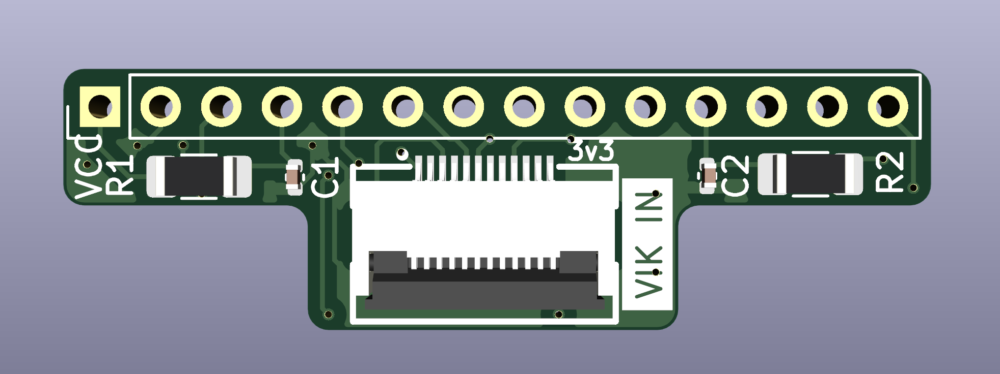
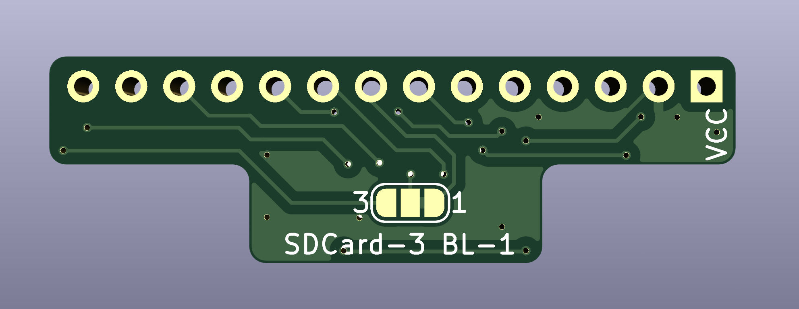
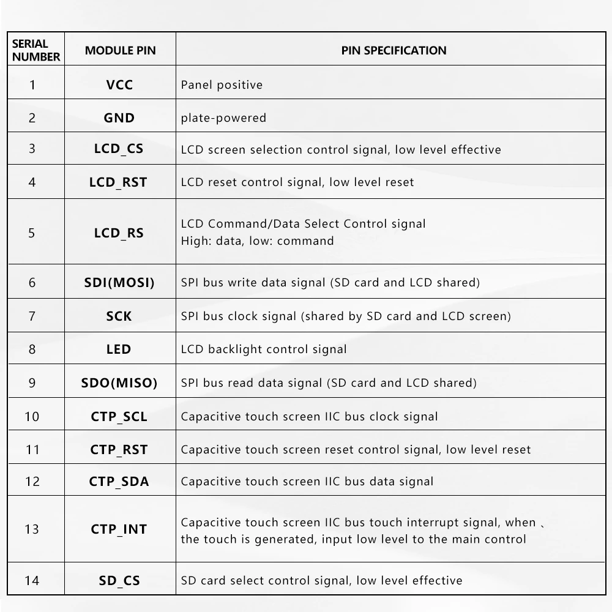

# ILI9341 display VIK module

## Overview

This is a VIK module made to add a VIK connector to the [ILI9341](https://www.aliexpress.us/item/3256805692275620.html) board ([alternate link](https://www.aliexpress.us/item/3256805720349132.html))

## Display housing 3D models

I have put together [display housings and covers](https://github.com/sadekbaroudi/fingerpunch/tree/master/3d-models/display-housings/ili9341) for this module, in the form of step files that you can download and incorporate into your own design.

## Fabrication and BOM

For PCB fabrication, you can use the files in the production folder.

* gerbers.zip - the file used to fabricate the pcb
* bom.csv - used for PCBA. You can also use the part numbers in this file to look up the exact parts as [lcsc.com](https://lcsc.com)
* positions.csv - used for PCBA

Using the 3 files above, this has been tested at [jlcpcb.com](https://jlcpcb.com)

# Display module dimensions

Look inside the `./images/` directory for dimensions for the various modules that this has been tested to work with. These images were all pulled from [lcdwiki.org](http://www.lcdwiki.com/Main_Page)

## VIK module certification

| Category                | Classification          | Response           |
| ----------------------- | ----------------------- | ------------------ |
| FPC connector           | Required                | :heavy_check_mark: |
| Breakout pins           | Recommended             | :x:                |
| Uses: SPI               | Optional                | :heavy_check_mark: |
| SPI used for SPI only   | Strongly recommended    | :heavy_check_mark: |
| Uses: I2C               | Optional                | :heavy_check_mark: |
| I2C used for I2C only   | Strongly Recommended    | :heavy_check_mark: |
| I2C pull ups            | Required                | :x:                |
| Uses: RGB               | Optional                | :x:                |
| Uses: Extra GPIO 1      | Optional                | :heavy_check_mark: |
| Uses: Extra GPIO 2      | Optional                | :heavy_check_mark: |
| Standard PCB Size/Mount | Strongly recommended    | :x:                |

## PCB images

## Assembled image

## Product images

## Product Spec images

