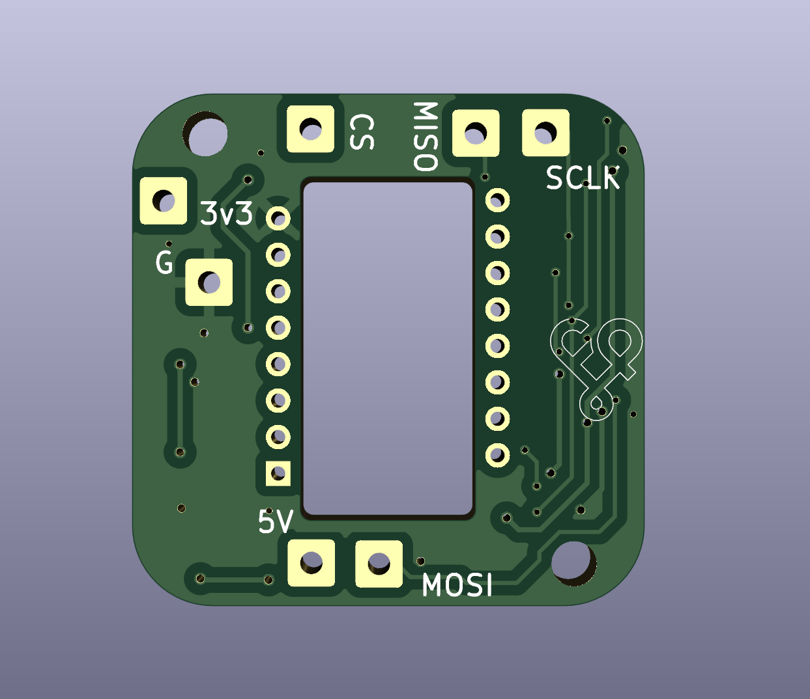
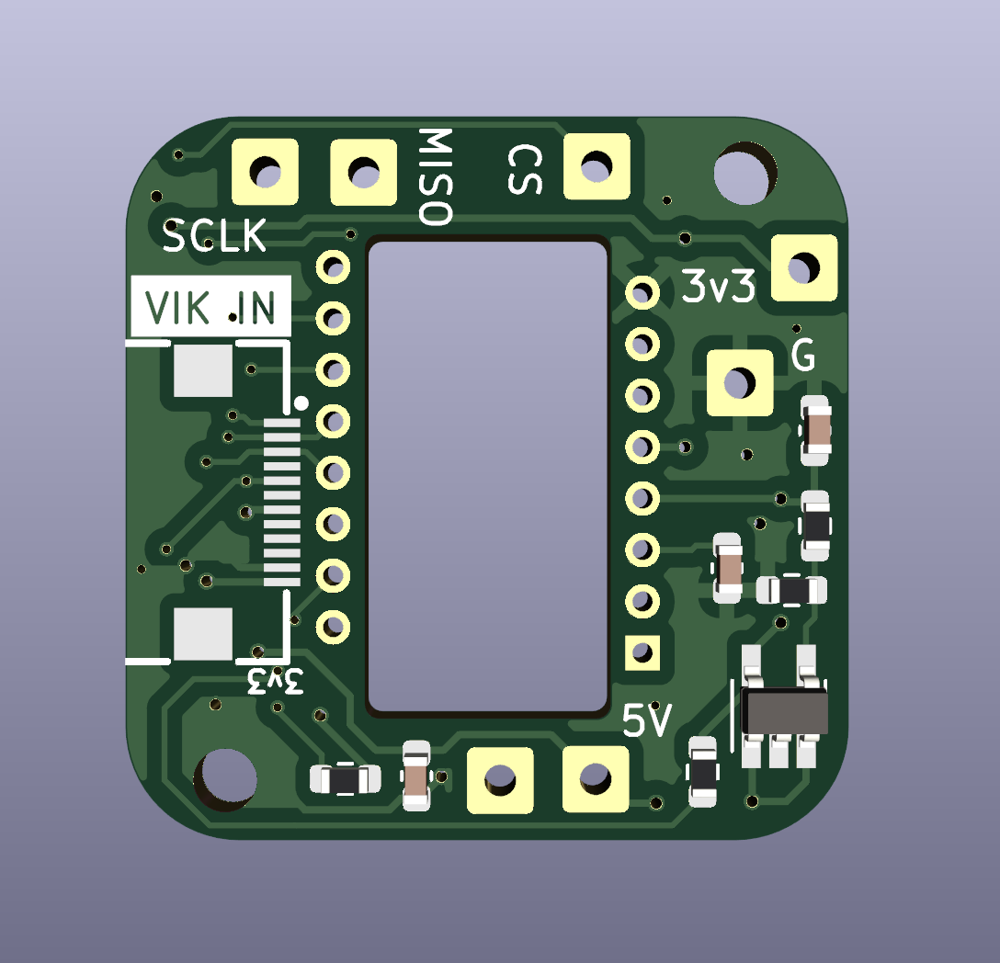

# PMW3360-xs trackball pcb

## Overview

This is a smaller version of the PMW3360 VIK module. The PMW3360 sensor is primarily used for mousing applications, and is supported in [QMK](https://github.com/qmk_firmware/qmk)

The most common use in the keyboard community is for trackballs.

## Fabrication and BOM

For PCB fabrication, you can use the files in the production folder.

* gerbers.zip - the file used to fabricate the pcb
* bom.csv - used for PCBA. You can also use the part numbers in this file to look up the exact parts as [lcsc.com](https://lcsc.com)
* positions.csv - used for PCBA

Using the 3 files above, this has been tested at [jlcpcb.com](https://jlcpcb.com)

## VIK module certification

| Category                | Classification          | Response           |
| ----------------------- | ----------------------- | ------------------ |
| FPC connector           | Required                | :heavy_check_mark: |
| Breakout pins           | Recommended             | :heavy_check_mark: |
| Uses: SPI               | Optional                | :heavy_check_mark: |
| SPI used for SPI only   | Strongly recommended    | :heavy_check_mark: |
| Uses: I2C               | Optional                | :x:                |
| I2C used for I2C only   | Strongly Recommended    | :x:                |
| I2C pull ups            | Required                | N/A                |
| Uses: RGB               | Optional                | :x:                |
| Uses: Extra GPIO 1      | Optional                | :x:                |
| Uses: Extra GPIO 2      | Optional                | :x:                |
| Standard PCB Size/Mount | Strongly recommended    | :x:                |

## PCB images

