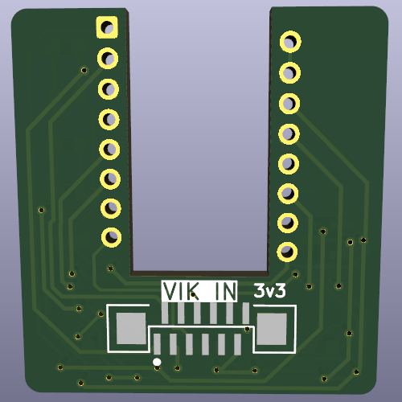
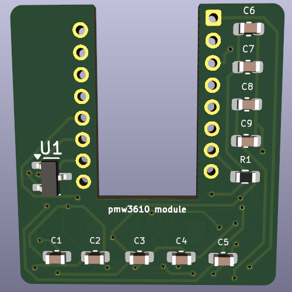

# PMW3610 trackball pcb - xxs version

## Overview

This module is similar to the other PMW3610 modules, but even smaller. It is the same size as the sensor PCB used in the [KeyBall](https://github.com/Yowkees/keyball) and its derative [roBa](https://github.com/kumamuk-git/roBa). This module was modified from the PMW3610 breakout module of the latter.
Do note that because of the connector size, the KeyBall trackball holder does need a small adjustment.

This is a VIK module to use a PMW3610 low power motion sensor. This sensor is primarily used for mousing applications. The most common use in the keyboard community is for (wireless) trackballs.

Note that while I2C, RGB, and extra GPIO are broken out, but are not used in the circuitry, so they are not needed for the sensor. There are also footprints for I2C pull up resistors, which are also not needed, as I2C is not used.

## IMPORTANT

The PMW3610 sensor is a low power sensor, and uses serial data communication with a motion status pin (to reduce power consumption). This pcb uses the SPI pins, but is not standard SPI communication. This means that you cannot connect this module to a controller or board that uses the VIK SPI pins for any other purpose. These are being treated as standard GPIO for this module. This is not a VIK compliant module!

That said, if you understand the above, you can still use this module with no issues.

## Fabrication and BOM

For PCB fabrication, you can use the files in the jlcpcb/production_files folder.

* `GERBER-pmw3610_xxs.zip` - the file used to fabricate the pcb
* `BOM-pmw3610_xxs.csv` - used for PCBA. You can also use the part numbers in this file to look up the exact parts as [lcsc.com](https://lcsc.com)
* `CPL-pmw3610_xxs.csv` - used for PCBA

Using the 3 files above, this has been tested at [jlcpcb.com](https://jlcpcb.com)
These files were generated by the [KiCAD JLCPCB tools plugin](https://github.com/Bouni/kicad-jlcpcb-tools).

## PCB images

To view the PCB and schematics without using KiCad copy this module's url in https://kicanvas.org or click [here](https://kicanvas.org/?github=https%3A%2F%2Fgithub.com%2Fsadekbaroudi%2Fvik%2Ftree%2Fmaster%2Fpcb%2Fpmw3610-xxs%2F). 