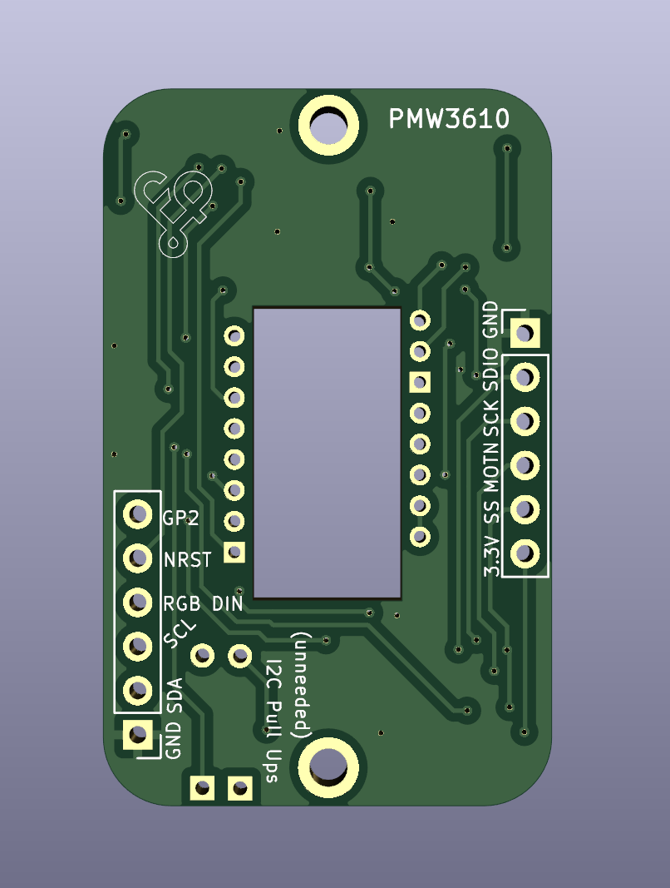
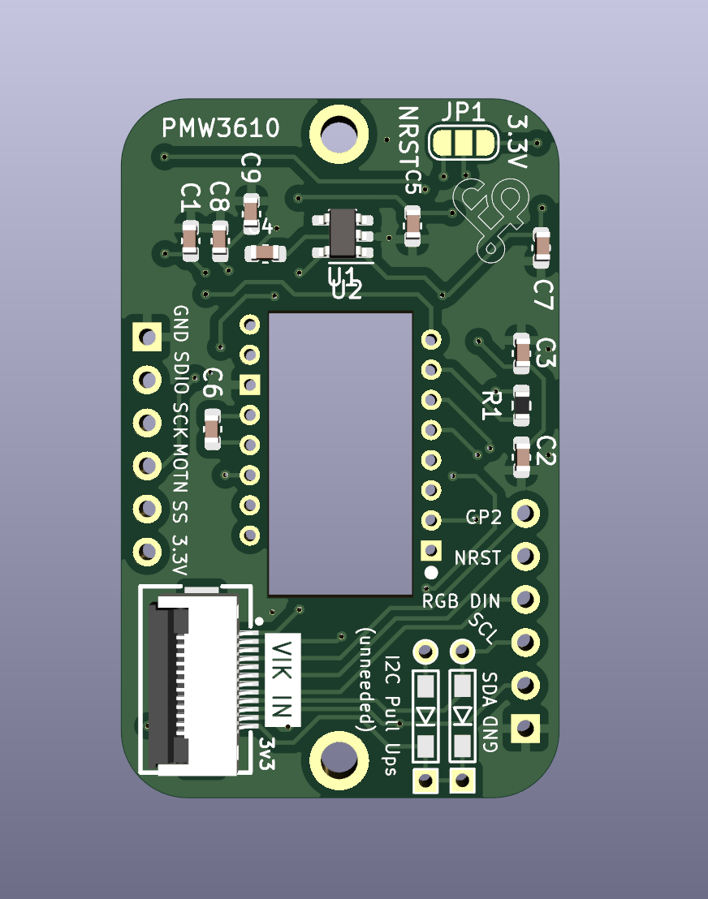

# PMW3610 trackball pcb

## Overview

This is a VIK module to use a PMW3610 motion sensor. This sensor is primarily used for mousing applications.

The most common use in the keyboard community is for trackballs.

Note that while I2C, RGB, and extra GPIO are broken out, but are not used in the circuitry, so they are not needed for the sensor. There are also footprints for I2C pull up resistors, which are also not needed, as I2C is not used.

## IMPORTANT

The PMW3610 sensor is a low power sensor, and uses serial data communication with a motion status pin (to reduce power consumption). This pcb uses the SPI pins, but is not standard SPI communication. This means that you cannot connect this module to a controller or board that uses the VIK SPI pins for any other purpose. These are being treated as standard GPIO for this module. This is not a VIK compliant module!

That said, if you understand the above, you can still use this module with no issues.

## Fabrication and BOM

For PCB fabrication, you can use the files in the production folder.

* gerbers.zip - the file used to fabricate the pcb
* bom.csv - used for PCBA. You can also use the part numbers in this file to look up the exact parts as [lcsc.com](https://lcsc.com)
* positions.csv - used for PCBA

Using the 3 files above, this has been tested at [jlcpcb.com](https://jlcpcb.com)

## VIK module certification

| Category                | Classification          | Response           |
| ----------------------- | ----------------------- | ------------------ |
| FPC connector           | Required                | :heavy_check_mark: |
| Breakout pins           | Recommended             | :heavy_check_mark: |
| Uses: SPI               | Optional                | :heavy_check_mark: |
| SPI used for SPI only   | Strongly recommended    | :x:                |
| Uses: I2C               | Optional                | :x:                |
| I2C used for I2C only   | Strongly Recommended    | :x:                |
| I2C pull ups            | Required                | N/A                |
| Uses: RGB               | Optional                | :x:                |
| Uses: Extra GPIO 1      | Optional                | :x:                |
| Uses: Extra GPIO 2      | Optional                | :x:                |
| Standard PCB Size/Mount | Strongly recommended    | Small              |

## PCB images

