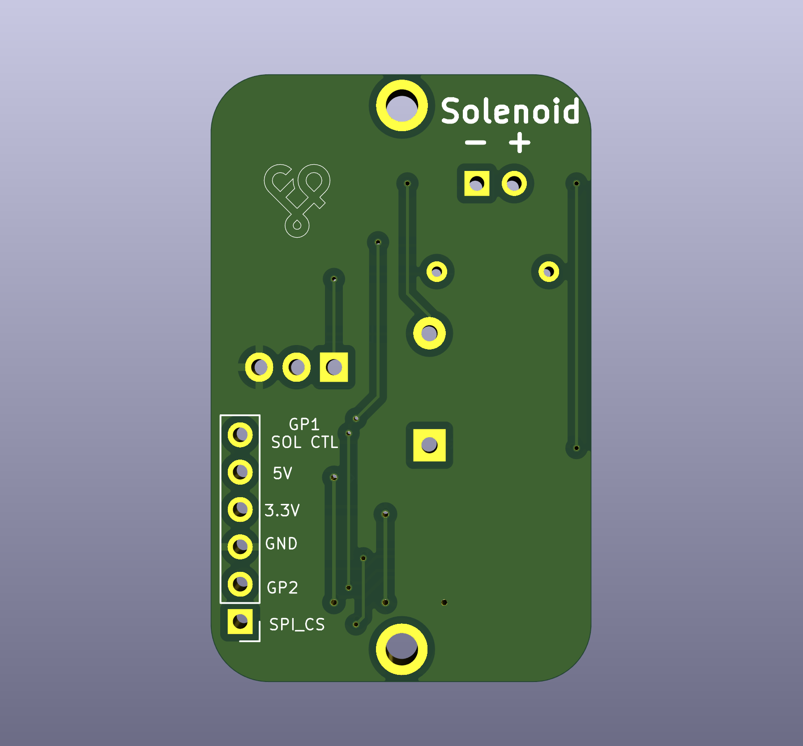

# solenoid

## vik repo version

### Overview (sadek version)

This is a VIK module by [sadekbaroudi](https://github.com/sadekbaroudi) to add a solenoid to a VIK enabled board or controller. It has the option to use 3.3v or 5v from VIK using a jumper, and additionally requires GND and GPIO_AD1.

### Fabrication and BOM (sadek version)

For PCB fabrication, you can use the files in the production folder.

* gerbers.zip - the file used to fabricate the pcb
* bom.csv - used for PCBA. You can also use the part numbers in this file to look up the exact parts as [lcsc.com](https://lcsc.com)
* positions.csv - used for PCBA

Using the 3 files above, this has been tested at [jlcpcb.com](https://jlcpcb.com)

For the parts not listed in the bom, you'll need the following:

| Quantity | Part name / number                                                | Example URL for purchase                                            |
| -------- | ----------------------------------------------------------------- | ------------------------------------------------------------------- |
| 1        | TIP120 - NPN Transistor                                           | https://www.aliexpress.us/item/2251832720365467.html                |
| 1        | 2.2K Ohm resistor                                                 | https://www.aliexpress.us/item/3256802900888178.html                |
| 1        | 1N4001 Rectifier Diode                                            | https://www.aliexpress.us/item/3256805759330925.html                |

### VIK module certification (sadek version)

| Category                | Classification          | Response           |
| ----------------------- | ----------------------- | ------------------ |
| FPC connector           | Required                | :heavy_check_mark: |
| Breakout pins           | Recommended             | :x:                |
| Uses: SPI               | Optional                | :x:                |
| SPI used for SPI only   | Strongly recommended    | :x:                |
| Uses: I2C               | Optional                | :x:                |
| I2C used for I2C only   | Strongly Recommended    | :x:                |
| I2C pull ups            | Required                | :x:                |
| Uses: RGB               | Optional                | :x:                |
| Uses: Extra GPIO 1      | Optional                | :heavy_check_mark: |
| Uses: Extra GPIO 2      | Optional                | :x:                |
| Standard PCB Size/Mount | Strongly recommended    | Small              |

## PCB images (sadek version)

## aleblazer version

### Overview (aleblazer version)

This is a VIK module created by [Aleblazer](https://github.com/Aleblazer) to add a solenoid to a controller. It requires 5V, GND, and the GPIO_AD1 VIK connection.

### Details (aleblazer version)

Please refer to the [VIK-solenoid repo](https://github.com/Aleblazer/VIK-Solenoid) for any necessary details.

Note that as of this writing, there is also a VIK xs (extra small) version in the [ExtraSmallVIK branch](https://github.com/Aleblazer/VIK-Solenoid/tree/ExtraSmallVIK)

### VIK module certification (aleblazer version)

| Category                | Classification          | Response           |
| ----------------------- | ----------------------- | ------------------ |
| FPC connector           | Required                | :heavy_check_mark: |
| Breakout pins           | Recommended             | :x:                |
| Uses: SPI               | Optional                | :x:                |
| SPI used for SPI only   | Strongly recommended    | :x:                |
| Uses: I2C               | Optional                | :x:                |
| I2C used for I2C only   | Strongly Recommended    | :x:                |
| I2C pull ups            | Required                | :x:                |
| Uses: RGB               | Optional                | :x:                |
| Uses: Extra GPIO 1      | Optional                | :heavy_check_mark: |
| Uses: Extra GPIO 2      | Optional                | :x:                |
| Standard PCB Size/Mount | Strongly recommended    | Small/XS           |

### PCB images (aleblazer version)

See repo linked above
