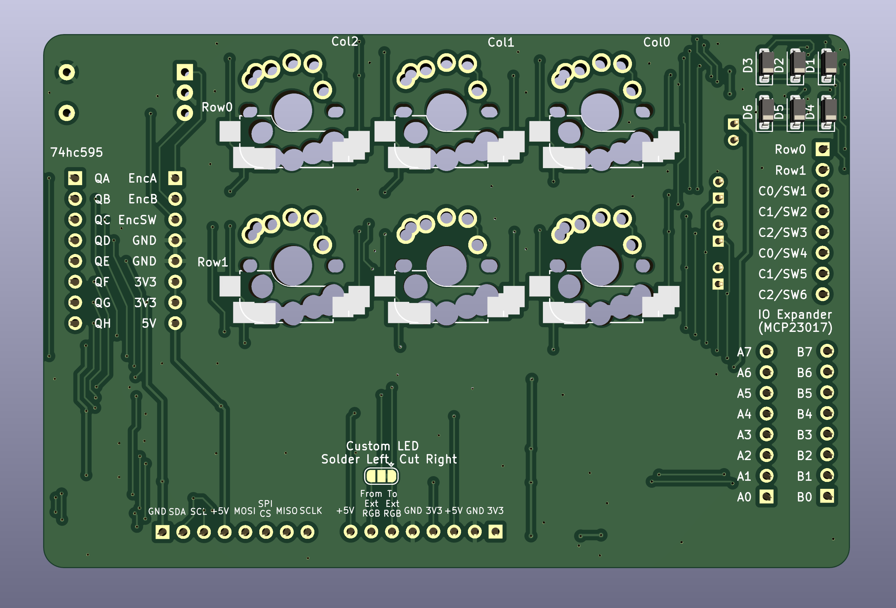

# VIK playground

## Overview

This is a VIK module designed to allow you to experiment and prototype.  

It includes:  
* MCP23017 I/O expander
* 74hc595 shift register
* WS2812B 5050 leds
* MX/Choc V1/Gateron low profile switch footprint, both hotswap and solderable
* Row/Column and Direct Pin switch configuration (default is Row/Column)
* EC11 footprint

All pins are broken out. If you have female headers connected, you can experiment with your wiring, write firmware, and prototype / test features.  

Big thank you to GeorgeN for the suggestion for this module!

## Fabrication and BOM

For PCB fabrication, you can use the files in the production folder.

* gerbers.zip - the file used to fabricate the pcb
* bom.csv - used for PCBA. You can also use the part numbers in this file to look up the exact parts as [lcsc.com](https://lcsc.com)
* positions.csv - used for PCBA

Using the 3 files above, this has been tested at [jlcpcb.com](https://jlcpcb.com)

## VIK module certification

| Category                | Classification          | Response           |
| ----------------------- | ----------------------- | ------------------ |
| FPC connector           | Required                | :heavy_check_mark: |
| Breakout pins           | Recommended             | :heavy_check_mark: |
| Uses: SPI               | Optional                | :heavy_check_mark: |
| SPI used for SPI only   | Strongly recommended    | :heavy_check_mark: |
| Uses: I2C               | Optional                | :heavy_check_mark: |
| I2C used for I2C only   | Strongly Recommended    | :heavy_check_mark: |
| I2C pull ups            | Required                | :heavy_check_mark: |
| Uses: RGB               | Optional                | :heavy_check_mark: |
| Uses: Extra GPIO 1      | Optional                | :heavy_check_mark: |
| Uses: Extra GPIO 2      | Optional                | :heavy_check_mark: |
| Standard PCB Size/Mount | Strongly recommended    | :x:                |

## PCB images

