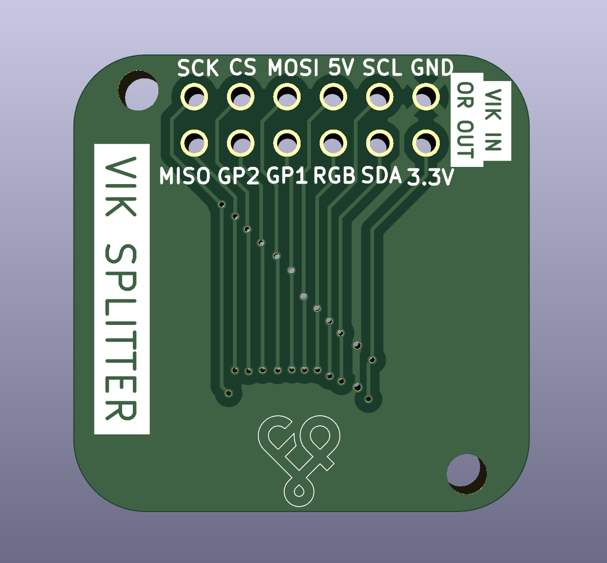
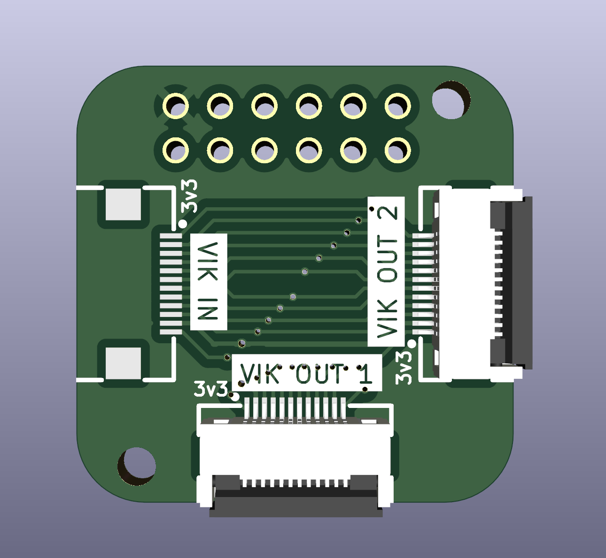

# vik-splitter

## Overview

This is a very simple pcb that takes in a VIK cable for input, and redirects them to two outputs.

Please note that *you* are responsible for ensuring that the two output modules don't conflict with each other.

Examples of using valid uses would be:
* Using one output module that uses SPI only, and one output module that uses I2C only
* Using two output modules that both only use I2C (but you should be aware of the pull up resistor values when combining two I2C modules
* Using one module that uses GP1 and GP2, and another module that uses SPI

Examples of invalid uses:
* Using two output modules that both use SPI (only because the CS pin can't be shared between them)
* Using one module that uses I2C and GP1, and another module that uses SPI and GP1

## Fabrication and BOM

For PCB fabrication, you can use the files in the production folder.

* vik-splitter.zip - the gerber file used to fabricate the pcb
* bom.csv - used for PCBA. You can also use the part numbers in this file to look up the exact parts as [lcsc.com](https://lcsc.com)
* positions.csv - used for PCBA

Using the 3 files above, this has been tested at [jlcpcb.com](https://jlcpcb.com)

## VIK module certification

| Category                | Classification          | Response           |
| ----------------------- | ----------------------- | ------------------ |
| FPC connector           | Required                | :heavy_check_mark: |
| Breakout pins           | Recommended             | :heavy_check_mark: |
| Uses: SPI               | Optional                | :heavy_check_mark: |
| SPI used for SPI only   | Strongly recommended    | N/A                |
| Uses: I2C               | Optional                | N/A                |
| I2C used for I2C only   | Strongly Recommended    | N/A                |
| I2C pull ups            | Required                | N/A                |
| Uses: RGB               | Optional                | N/A                |
| Uses: Extra GPIO 1      | Optional                | N/A                |
| Uses: Extra GPIO 2      | Optional                | N/A                |
| Standard PCB Size/Mount | Strongly recommended    | :heavy_check_mark: |

Note that all of the `N/A` values above are there only because they are dependent on the modules being connected on the VIK OUT connectors.

## PCB images

