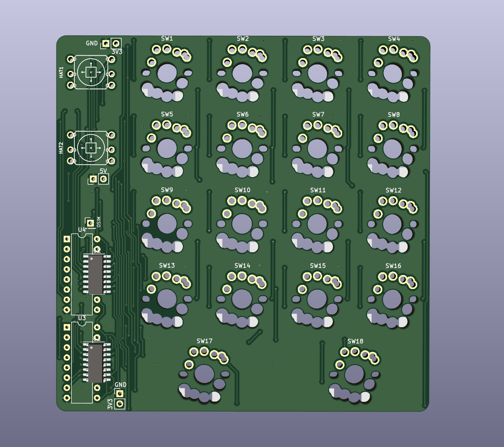
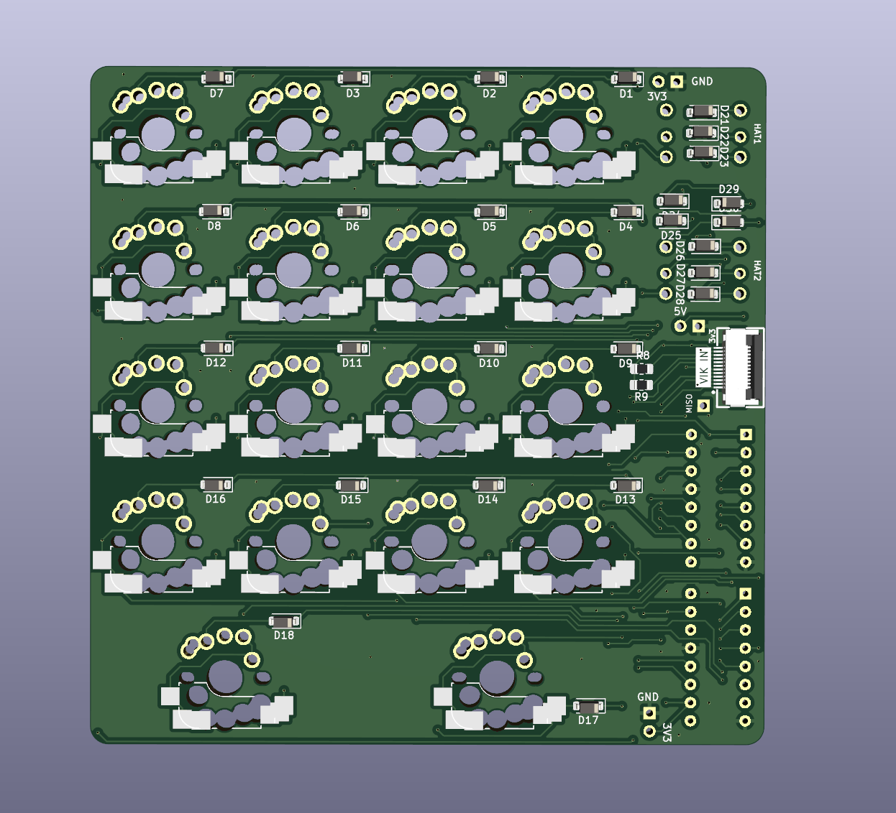

# vikropad

## Overview

This is a VIK module designed to demonstrate a macropad using 2 shift registers for the columns, and using VIK GPIO AD1 and GPIO AD2 for the rows.

It requires some custom firmware to handle the matrix scanning, as it's independent of whatever keyboard you connect this to.

It includes:  
* 2x 74hc595 shift register (THT or SMD)
* [2x 5 way switch hat](https://www.adafruit.com/product/504), e.g. adafruit 504
* MX/Choc V1/Gateron low profile switch footprint, both hotswap and solderable

All pins are broken out (except RGB), either via the shift registers or extra through holes.

## Fabrication and BOM

For PCB fabrication, you can use the files in the production folder.

* gerbers.zip - the file used to fabricate the pcb
* bom.csv - used for PCBA. You can also use the part numbers in this file to look up the exact parts as [lcsc.com](https://lcsc.com)
* positions.csv - used for PCBA

Using the 3 files above, this has been tested at [jlcpcb.com](https://jlcpcb.com)

## VIK module certification

| Category                | Classification          | Response           |
| ----------------------- | ----------------------- | ------------------ |
| FPC connector           | Required                | :heavy_check_mark: |
| Breakout pins           | Recommended             | :heavy_check_mark: |
| Uses: SPI               | Optional                | :heavy_check_mark: |
| SPI used for SPI only   | Strongly recommended    | :heavy_check_mark: |
| Uses: I2C               | Optional                | :x:                |
| I2C used for I2C only   | Strongly Recommended    | N/A                |
| I2C pull ups            | Required                | :heavy_check_mark: |
| Uses: RGB               | Optional                | :heavy_check_mark: |
| Uses: Extra GPIO 1      | Optional                | :heavy_check_mark: |
| Uses: Extra GPIO 2      | Optional                | :heavy_check_mark: |
| Standard PCB Size/Mount | Strongly recommended    | :x:                |

## PCB images

