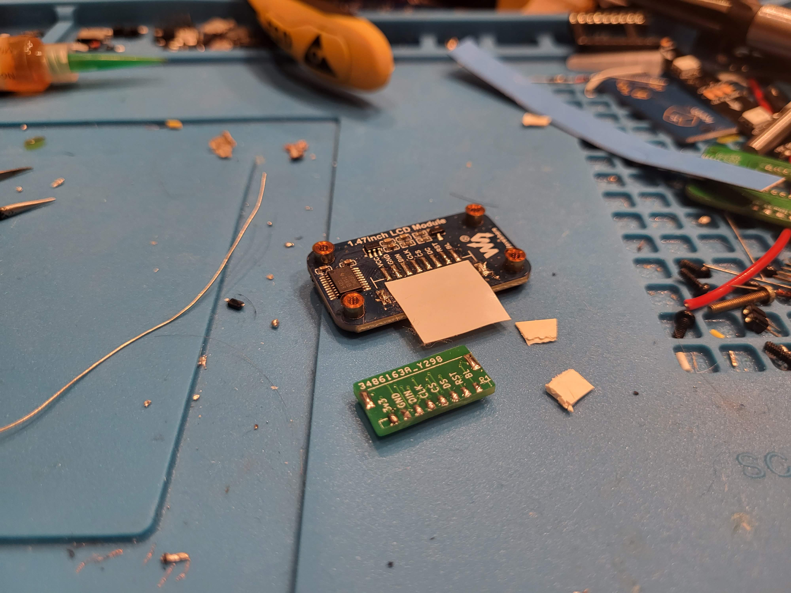
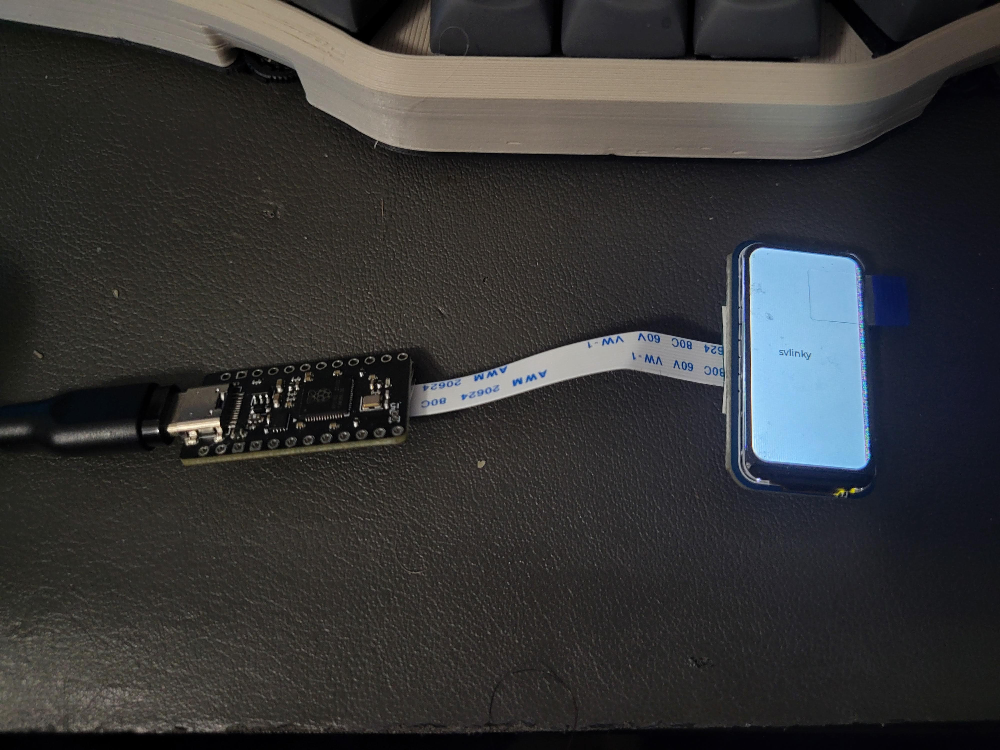
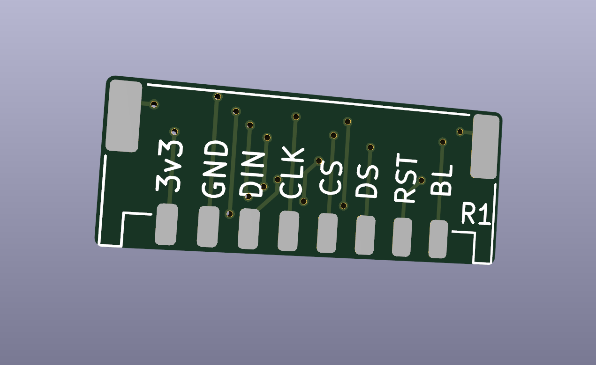
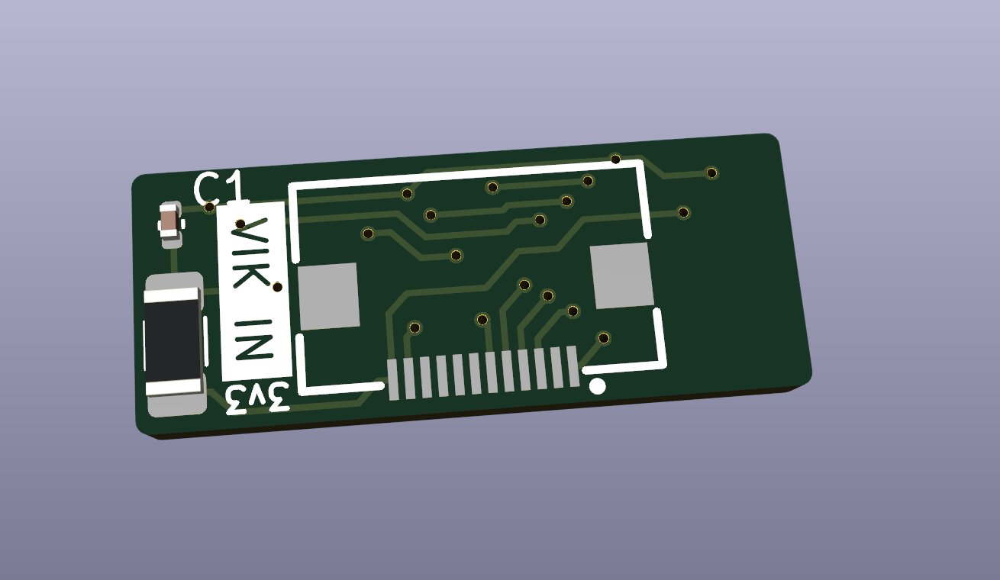

# Waveshare 22224 display VIK adapter

## Overview

This is a VIK module made to add a VIK connector to the [Waveshare 22224 1.47in display](https://www.waveshare.com/1.47inch-lcd-module.htm) breakout board.

## Assembly

If you did not do PCBA on the VIK module (the hand solder gerbers):  
1. Solder the FPC connector onto the module
2. Solder a 0805 100k-200k ohms resistor (the pads right next to the 3v3 marking)
3. Solder a 0805 1uF capacitor (the pads above the resistor pads in step 2 above)

If you did PCBA, skip the steps above and continue here:  
1. Add solder to each pad on the VIK module
2. Remove the existing connector from the waveshare. Cut the leads and around the plastic of the connector, and de-solder the remaining pieces one by one
3. Put a piece of non-conductive tape cut out to the inside of the connector (just to ensure there are no shorts)
4. Line up the pads of the VIK module with the waveshare module, and heat up the pads one by one, adding solder each time, making sure 5. the pads form a connection between the waveshare and the VIK module

## Fabrication and BOM

For PCB fabrication, you can use the files in the production folder.

* gerbers.zip - the file used to fabricate the pcb
* bom.csv - used for PCBA. You can also use the part numbers in this file to look up the exact parts as [lcsc.com](https://lcsc.com)
* positions.csv - used for PCBA

Using the 3 files above, this has been tested at [jlcpcb.com](https://jlcpcb.com)

## VIK module certification

| Category                | Classification          | Response           |
| ----------------------- | ----------------------- | ------------------ |
| FPC connector           | Required                | :heavy_check_mark: |
| Breakout pins           | Recommended             | :x:                |
| Uses: SPI               | Optional                | :heavy_check_mark: |
| SPI used for SPI only   | Strongly recommended    | :heavy_check_mark: |
| Uses: I2C               | Optional                | :x:                |
| I2C used for I2C only   | Strongly Recommended    | :x:                |
| I2C pull ups            | Required                | N/A                |
| Uses: RGB               | Optional                | :x:                |
| Uses: Extra GPIO 1      | Optional                | :heavy_check_mark: |
| Uses: Extra GPIO 2      | Optional                | :heavy_check_mark: |
| Standard PCB Size/Mount | Strongly recommended    | :x:                |

## PCB images

